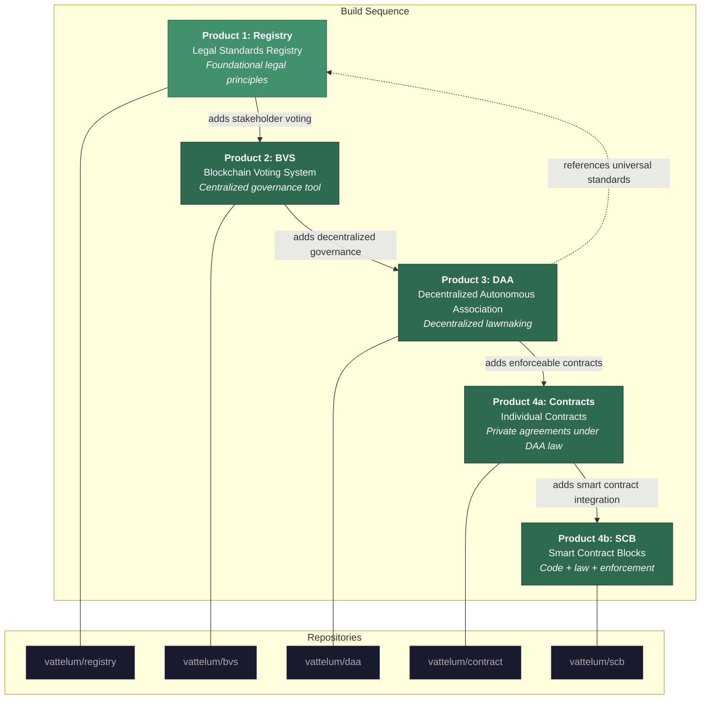

# Vattelum

**An open-source framework merging decentralized technology with enforceable law.**

---

## Introduction

There was a time blockchain technology promised to govern the world.

A new financial system. New kinds of corporations. Even new nations. 

This did not happen.

...Why?

The world is governed by laws, not by ledger entries.

This industry *cannot* live up to its potential without a way to effect rights and duties in the real world...

...**Vattelum** serves as the missing bridge.

---

## Vattelum

Vattelum is an open-source toolkit that builds a dynamic body of voluntary, private law using blockchain technology. The result is a living legal registry anyone can deploy, reference, and build on.

Vattelum enables the creation and permanent recording of binding law on the blockchain. It functions both as a tool for private law creation and a governance layer for decentralized technologies.

### Why Build Vattelum?

We got into this industry for a reason: decentralization. Networks of equals operating under fair and voluntary standards. Vattelum returns to those values.

For years, blockchain projects created legal structures without law: DAOs without legal personality, smart "contracts" that did not bind, jurisdictions without enforcement.

By using proven private legal frameworks, Vattelum takes the opposite approach. The result is governance that carries real-world weight, contracts that hold up in arbitration, and legal standards that travel across borders.

Vattelum is built on these principles: that people can create binding law together; that blockchain provides the permanence and transparency that law requires; and that arbitration provides enforcement where code falls short.

...*Law creation does not require permission*...

Fork it, deploy it, build on it. Create your own jurisdiction in an afternoon. Successful laws can be referenced across the ecosystem.

Will you create the new standards this industry needs?

### The Vattelum Name

Vattelum is named after the Swiss legal scholar Emerich de Vattel. He was instrumental in transforming the principles of natural law—a law of sovereign equals—into a working system of international law.

In a world (and particularly an industry) now suffering from the overreach of international law, this project aims to law's once-true origins: the harmonization of rights and duties among equals and across borders.

---

## Vattelum: a Decentralized Legal System

Vattelum is the first functional example of a Decentralized Legal System (DLS). It is built on the consent of its participants rather than governmental authority. It exists in cyberspace but carries force in the real world. It relies on existing arbitration frameworks to connect decentralized technology with an existing, enforceable legal structure.

The DLS concept was first published in 2018 as a [whitepaper](https://decentralizedlegalsystem.com/whitepaper/), as a reaction to the 2017 ICO explosion of legal applications without law (most of which since have disappeared).

Over the following years, the legal theory was deepened and expanded, resulting in a [free book](https://decentralizedlaw.org/book/) published in 2025. It covers the full legal foundation: from the nature of law to enforceable frameworks for decentralized technologies.

The system operates through three layers:

<div align="center">
  
</div>

**Enforcement Framework** — The New York Convention on the Recognition and Enforcement of Foreign Arbitral Awards makes private arbitration rulings enforceable in 172 countries. Most online interactions are already governed by arbitration. This is what connects cyberspace to the real world.

**Established Governing Laws** — The authority layer. Proven legal systems—such as English law or the UNIDROIT Principles—give the framework legal weight and predictability. Arbitrators and courts rely on these to interpret and adjudicate disputes.

**Decentralized Legal Frameworks** — The innovation layer. This is where participants build: Decentralized Autonomous Associations (DAAs) creating decentralized law, Smart Contract Blocks that merge code with legal contracts, Consensus Jurisdictions of groups creating their own binding legal standards.

### And... Everything Is Now In Place to Build This...

At its core, the DLS produces private contracts under an arbitration framework. Legal force comes from the consent of the participants. 

The legal infrastructure has existed for decades: international arbitration is already enforceable in 172 countries, and most online interactions are already governed by private arbitration frameworks.

And with the currently available blockchain technology for voting and online storage we can finally build this!

---

## The Projects

The Vattelum organization develops an open-source toolkit that implements the DLS as usable software. Five products, each building on the previous.

### 1. [Registry — Legal Standards Registry](https://github.com/vattelum/registry) ✅ (Complete and Deployed)
A curated registry of foundational legal principles and standards. Anyone can deploy their own registry and start creating legal standards. The aim is to have trusted parties publish universal standards, governing laws, and blockchain principles that can be cited throughout the entire stack (standardization across the ecosystem).

https://github.com/user-attachments/assets/cbd1a37c-44c6-465c-9f65-2dc81f672560

### 2. BVS — Blockchain Voting System 🚧 (Under development)

A registry allowing an organization to put proposals to a stakeholder vote and permanently record the outcomes on-chain. The BVS makes beneficial blockchain voting tools available to a single legal person or entity, thus avoiding the legal complexity of DAOs.

### 3. DAA — Decentralized Autonomous Association 🚧 (Under development)

The DAA deliberately is not a DAO, because it does not try to be an organization. It is an association of equals. The DAA does not perform regulated activities. There is no treasury, no tradable tokens, and no shared liability.

Independent legal persons draft, discuss, vote on, and permanently record binding standards and shared principles.

### 4a. Contract Layer 🚧 (Under development)

The contract layer turns DAA governing laws into binding agreements between specific parties. It stores an encrypted contract on-chain, exportable together with its governing laws as a signed PDF for use in arbitration or court.

### 4b. SCB — Smart Contract Blocks 🚧 (Under development)

The SCB combines a legally enforceable human-language contract with a smart contract. The Smart Contract Block merges code, law, and enforcement into one package, signed on-chain and printable as PDF.

---



---

## The Legal Stack and How the Projects Interact

Every document in the system—individual contracts, DAA legislation, universal standards—is citable using a consistent on-chain referencing format. A signed agreement between two parties links to the DAA laws that govern it, which in turn reference the universal standards they adopt (which is optional), which sit under the governing law chosen for dispute resolution and real world enforcement.

```
Governing Law (e.g., English law)
  └── Universal Standards (Selected by parties from Registry)
        └── DAA Legislation (binding on members or selected by parties)
              └── Individual Contract (binding on parties)
```

A single signed contract can be traced all the way up to its governing law through on-chain references. The entire legal package—contract, governing legislation, universal standards, and verification data—can be exported as a single PDF which constitutes as on binding agreement for use in arbitration or court.

---

## Open Source & Community

The toolkit is open source. Anyone can deploy it, fork it, and build on it.

The goal is foundational infrastructure designed to be self-sustaining. This is not a permanently managed software product. It is a public good; legal rails for decentralized cooperation.

This project is in active development. Feedback and suggestions are more than welcome.

This project's Achilles' heel for all its years has been lack of awareness. If any of the ideas presented here resonate with you even a little, please post or share this project. It makes all the difference!

Few understand the core legal issues and solutions in this industry, and if you do not share it... *nobody will...*

---

## Links & Resources

| | |
|---|---|
| **Whitepaper** | [The Decentralized Legal System (2018)](https://decentralizedlegalsystem.com/whitepaper/) |
| **Book** | Decentralized Law: The Power of Blockchain to Transform the Broken Legal System (2025)<br>[Available for free](https://decentralizedlaw.org/book/) |
| **Discord** | [Join](https://discord.gg/7XJASAKt87) |
| **Telegram** | [Join](https://telegram.me/+knXyr7M8u61hZGRl) |
| **X** | [@Decentral_Law](https://x.com/Decentral_Law) |
| **Email** | [github@decentralizedlaw.org](mailto:github@decentralizedlaw.org) |
