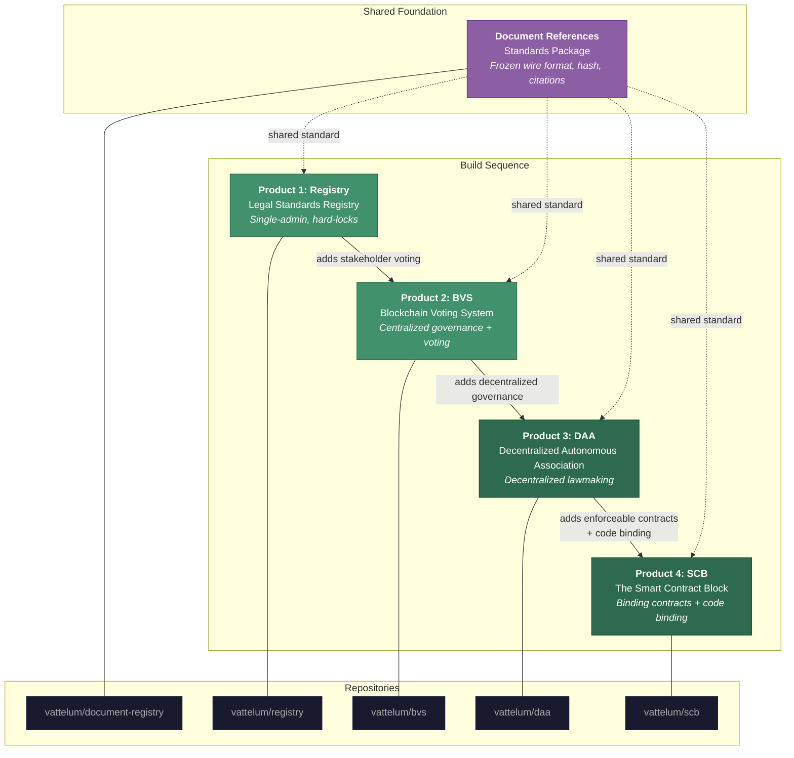

# Vattelum

**An open-source framework merging decentralized technology with enforceable law.**

---

## Introduction

There was a time when blockchain technology promised to govern the world.

A new financial system. New kinds of corporations. Even new nations. 

This did not happen.

...Why?

The world is governed by laws, not by ledger entries.

This industry *cannot* live up to its potential without a way to effect laws in the real world...

...**Vattelum** serves as the missing bridge.

### Explanatory Video

https://github.com/user-attachments/assets/ce680b0b-1bd9-41e0-a893-d9d2dce3964a

---

## Vattelum

Vattelum is an open-source toolkit that builds a dynamic body of voluntary, private law using blockchain technology. The result is a living legal registry anyone can deploy, reference, and build on.

Vattelum enables the creation and permanent recording of binding law on the blockchain. It functions both as a tool for private law creation and a governance layer for decentralized technologies.

### Why Do We Need Vattelum?

Blockchains created a new reality: a financial system outside of the control of any individual legal system.

The technical success of peer-to-peer transactions convinced this industry that blockchain technology could simply take over the financial system. That real-world assets would trade freely "on-chain." New organizations, new markets, and even new countries would be built "on top" of the blockchain.

Slowly but surely, this industry realized that the "off-chain" real world is governed by laws, not technology. And the law assumes that intermediaries run the financial system.

Instead of taking an active role in shaping the laws for a decentralized economy, this industry looked towards regulators for "legal certainty." The regulators responded by applying the same laws for financial institutions to any service provider in this industry. Ever since, industry legal professionals have spent all their time shoehorning the tech into ever more restrictive frameworks.

*Consequently, nobody builds the laws and frameworks needed for a functioning decentralized economy...*

### Vattelum offers this industry a chance to make its own laws...

By using proven private legal frameworks, Vattelum takes a bottom-up approach. Vattelum's blockchain governance carries real-world weight, its contracts hold up in arbitration, and its legal standards apply across borders.

Vattelum is built on these principles: that people can create binding law together; that blockchain provides the permanence and transparency that law requires; and that arbitration provides a bridge into the real world of rights and duties where code falls short.

Vattelum allows you to create the legal standards this industry needs.

Fork it, deploy it, build on it. Create your own jurisdiction in an afternoon. Successful laws will be referenced across the ecosystem.

**...Law creation does not require permission: start today!...**

### The Vattelum Name

Vattelum is named after the Swiss legal scholar Emerich de Vattel. He was instrumental in transforming the principles of natural law—a law of sovereign equals—into a working system of international law.

In a world (and particularly an industry) now suffering from the overreach of international law, this project aims to restore law's once-true origins: the harmonization of rights and duties among equals and across man-made boundaries.

---

## Vattelum: a Decentralized Legal System

Vattelum is the first functional example of a Decentralized Legal System (DLS). It builds on participant consent rather than governmental authority. It exists in cyberspace but carries force in the real world. It relies on existing arbitration frameworks to connect decentralized technology with an existing, enforceable legal structure.

The DLS concept was first published in 2018 as a [whitepaper](https://decentralizedlegalsystem.com/whitepaper/), as a reaction to the 2017 ICO explosion of legal applications without law (most of which since have disappeared).

Over the following years, the legal theory was deepened and expanded, resulting in a [free book on decentralized law](https://decentralizedlaw.org/book/) published in 2025. It covers the full legal foundation: from the nature of law to enforceable frameworks on blockchain technology.

The system operates through three layers:

  

**Enforcement Framework** — The New York Convention on the Recognition and Enforcement of Foreign Arbitral Awards makes private arbitration rulings enforceable in 172 countries. Most online interactions are already governed by arbitration. This is what connects cyberspace to the real world.

**Established Governing Laws** — The authority layer. Proven legal systems—such as English law or the UNIDROIT Principles—give the framework legal weight and predictability. Arbitrators and courts rely on these to interpret and adjudicate disputes.

**Decentralized Legal Frameworks** — The innovation layer. This is where participants build: Decentralized Autonomous Associations (DAAs) creating decentralized law, Smart Contract Blocks (SCBs) that merge code with legal contracts, Consensus Jurisdictions creating their own binding legal standards, and more...

### Everything Is Now In Place...

At its core, Vattelum produces private contracts under an arbitration framework. Legal force comes from the consent of the participants. Participation is voluntary.

The legal infrastructure has existed for decades: international arbitration is already enforceable in 172 countries, and most online interactions are already governed by private arbitration frameworks.

And helped by the currently available blockchain technology for voting and online storage, Vattelum finally became possible...

Will you help redirect this industry from its legal delusions onto a path of self-determination and private law creation?

---

## The Project

The Vattelum organization develops an open-source toolkit that implements the DLS as usable software. The result: four core products and one shared standards package.

The package fixes a citation format and the content-hash procedure. By using this standard, the entire Vattelum ecosystem becomes interoperable. This means that anyone can join and cite or create law.

The Registry allows anyone to become a law-maker. The Blockchain Voting System (BVS) creates a legally neutral tool for anyone to invite their stakeholders to vote on policies and standards. The Decentralized Autonomous Association (DAA) offers its members decentralized law-making. And finally, everything comes together in the Smart Contract Block, merging on-chain law with smart contracts to create legally binding agreements.

### Foundation — [The Vattelum Document Reference Package](https://github.com/vattelum/document-registry) ✅ (Published — experimental release; the wire format and APIs stabilise at v1.0)

Building a network of registries across the EVM ecosystem requires a single, frozen standard for citing, hashing, and verifying documents. Without it, the stack drifts apart.

The package solves that. It ships in two halves:

- **The Solidity half** defines the on-chain wire format—the `Document` and `DocumentReference` structs, the `IDocumentRegistry` read interface, and the relation- and document-type constants. Any registry that declares `is IDocumentRegistry` is compile-time-checked to expose the right reads.

- **The JavaScript / TypeScript half** ships the deterministic algorithms—content hashing, citation formatting, status resolution, address checksumming—as pure functions, so two clients computing the same hash or the same citation always produce byte-identical output.

This is what makes a contract signed today still verifiable in twenty years: the hash procedure is frozen, the citation format is frozen, and every product in the ecosystem reaches for the same package.

### 1. Registry — [Legal Standards Registry](https://github.com/vattelum/registry) ✅ (Complete and Deployed)

A curated registry of foundational legal principles and standards, run by a single admin. Anyone can deploy their own registry and start creating legal standards. The aim is to have trusted parties publish universal standards, governing laws, and blockchain principles that can be cited throughout the entire stack. The result: standardization across the ecosystem.

The Registry adds one novel guarantee on top of the standard: hard-lock amendment restrictions. When the admin locks a document, the lock is cryptographically binding for its duration—the admin itself cannot override it. The contract is the constraint.

https://github.com/user-attachments/assets/d4bfd9dc-1f54-4c7f-91f1-747b2ff9a4df

### 2. BVS — [Blockchain Voting System](https://github.com/vattelum/bvs) ✅ (Complete and Deployed)

A registry allowing an organization to put proposals to a stakeholder vote and permanently record the outcomes on-chain. The BVS makes beneficial blockchain voting tools available to a single legal person or entity, thus avoiding the legal complexity of DAOs.

Stakeholders hold soulbound membership tokens and vote on Snapshot X (on-chain). The admin records both ratifications and rejections, so every decision—accepted or refused—becomes a permanent, independently verifiable record.

https://github.com/user-attachments/assets/5bce30e5-9f05-465b-a14e-1a980d423815

### 3. DAA — [Decentralized Autonomous Association](https://github.com/vattelum/daa) ✅ (Complete and Deployed)

The DAA is deliberately not a DAO, because it does not try to be an organization. It is an association of equals. The DAA does not perform regulated activities. There is no treasury, no tradable tokens, and no shared liability.

Independent legal persons draft, discuss, vote on, and permanently record binding standards and shared principles. Membership is open and self-served. Proposals are voted on through Snapshot X and execute automatically through a Gnosis Safe once they pass.

To decentralize, the deployer hands the registry to governance and steps away—after handover, no individual controls the laws.

https://github.com/user-attachments/assets/1bf747e9-978a-4c2d-82b7-f28c50b30505

### 4. SCB — [The Smart Contract Block](https://github.com/vattelum/scb) ✅ (Complete and Deployed)

The SCB turns any citable legislation into binding agreements between specific parties—and secures those agreements to a deployed Ethereum smart contract.

Two or more parties pick a contract template and the governing laws from a DAA (or any other) registry, fill in the variables, and submit. The contract text is hashed, encrypted, and stored on Arweave; the hash and a content pointer go on-chain.

Every signatory decrypts the contract in their browser using their wallet, signs with an EIP-712 structured signature, and once everyone has signed the contract becomes Active. It can be printed as a complete PDF—template, governing laws, signatures, and an independently verifiable appendix—for use in arbitration or court.

The SCB also stores a content-addressed reference to a deployed smart contract (address + bytecode hash + chain ID), so the legal text and the code that implements it are bound together on-chain.

https://github.com/user-attachments/assets/35c52245-38ce-4241-b706-fdb070fd31ef

---

## Vattelum Project Overvew

```mermaid
graph TD
    subgraph "Shared Foundation"
        P0["<b>Document References</b><br/>Standards Package<br/><i>Frozen wire format, hash, citations</i>"]
    end

    subgraph "Build Sequence"
        P1["<b>Product 1: Registry</b><br/>Legal Standards Registry<br/><i>Single-admin, hard-locks</i>"]
        P2["<b>Product 2: BVS</b><br/>Blockchain Voting System<br/><i>Centralized governance + voting</i>"]
        P3["<b>Product 3: DAA</b><br/>Decentralized Autonomous Association<br/><i>Decentralized lawmaking</i>"]
        P4["<b>Product 4: SCB</b><br/>The Smart Contract Block<br/><i>Binding contracts + code binding</i>"]
    end

    P0 -.->|"shared standard"| P1
    P0 -.->|"shared standard"| P2
    P0 -.->|"shared standard"| P3
    P0 -.->|"shared standard"| P4

    P1 -->|"adds stakeholder voting"| P2
    P2 -->|"adds decentralized governance"| P3
    P3 -->|"adds enforceable contracts<br/>+ code binding"| P4

    subgraph "Repositories"
        R0["vattelum/document-registry"]
        R1["vattelum/registry"]
        R2["vattelum/bvs"]
        R3["vattelum/daa"]
        R4["vattelum/scb"]
    end

    P0 --- R0
    P1 --- R1
    P2 --- R2
    P3 --- R3
    P4 --- R4

    style P0 fill:#8C5EA4,stroke:#68247E,color:#fff
    style P1 fill:#40916c,stroke:#2d6a4f,color:#fff
    style P2 fill:#40916c,stroke:#2d6a4f,color:#fff
    style P3 fill:#2d6a4f,stroke:#1b4332,color:#fff
    style P4 fill:#2d6a4f,stroke:#1b4332,color:#fff
    style R0 fill:#1a1a2e,stroke:#16213e,color:#aaa
    style R1 fill:#1a1a2e,stroke:#16213e,color:#aaa
    style R2 fill:#1a1a2e,stroke:#16213e,color:#aaa
    style R3 fill:#1a1a2e,stroke:#16213e,color:#aaa
    style R4 fill:#1a1a2e,stroke:#16213e,color:#aaa
```

---

## Open Source & Community

The toolkit is open source. Anyone can deploy it, fork it, and build on it.

The goal is foundational infrastructure designed to be self-sustaining. This is not a permanently managed software product. It is a public good: legal rails for decentralized cooperation.

This project is in active development. Feedback and suggestions are more than welcome—especially on the package, which we want to bring to a stable v1.0.

This project's Achilles' heel for all its years has been lack of awareness. If any of the ideas presented here resonate with you, please post or share this project. It makes all the difference!

---

## Links & Resources

| | |
|---|---|
| **Website** | [Vattelum: Open-Source Lawmaking on the Ethereum Blockchain](https://delawlabs.com/vattelum) |
| **Original Whitepaper** | [The Decentralized Legal System (2018)](https://decentralizedlegalsystem.com/whitepaper/) |
| **Book** | [Decentralized Law: The Power of Blockchain to Transform the Broken Legal System (2025)](https://decentralizedlaw.org/book/) |
| **Discord** | [Join](https://discord.gg/7XJASAKt87) |
| **Telegram** | [Join](https://telegram.me/+knXyr7M8u61hZGRl) |
| **X** | [@Decentral_Law](https://x.com/Decentral_Law) |
| **Email** | [github@decentralizedlaw.org](mailto:github@decentralizedlaw.org) |
